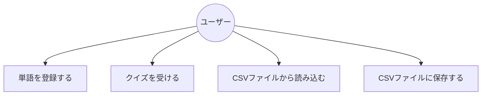

# 要件定義書

## 1. システム概要

このプログラムは英単語を勉強する時に使います。
英単語と日本語訳を登録して、クイズができます。
登録した単語をファイルに保存でき、読み込むことができます。

## 2. 機能要件

1. 単語登録機能
   - 英単語と日本語訳を登録できます。
   - CSVファイルから一括登録できます。

2. クイズ機能
   - ランダムに単語が出題されます。
   - 正解数と総問題数が表示されます。

3. データ管理機能
   - 登録した単語をCSVファイルに保存できます。
   - 保存したデータを読み込めます。

## 非機能要件

1. 使いやすさ
   - シンプルなメニュー構成です。
   - 分かりやすい日本語表示です。

2. 性能
   - 即時レスポンスを実現します。
   - 最大1000単語まで管理できます。

## 2. ユースケース図

