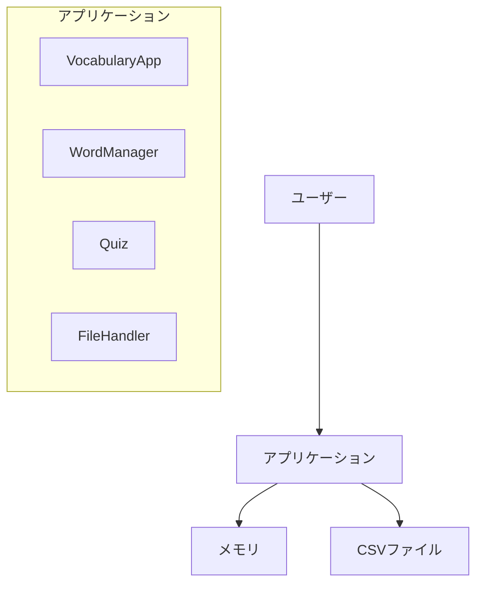

# システム構成図

```mermaid
graph TD
    A[ユーザー] --> B[アプリケーション]
    B --> C[メモリ]
    B --> D[CSVファイル]
    subgraph アプリケーション
        E[VocabularyApp]
        F[WordManager]
        G[Quiz]
        H[FileHandler]
    end
```
