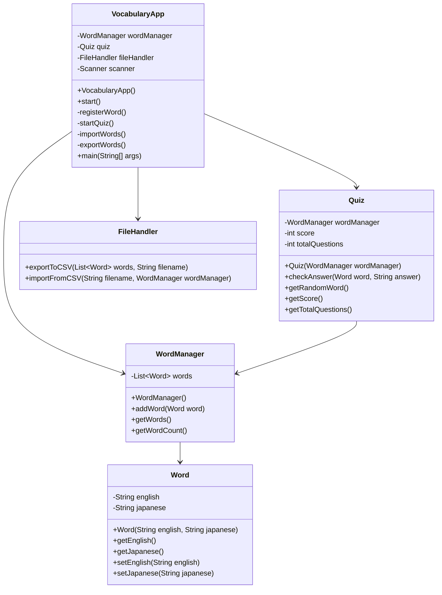
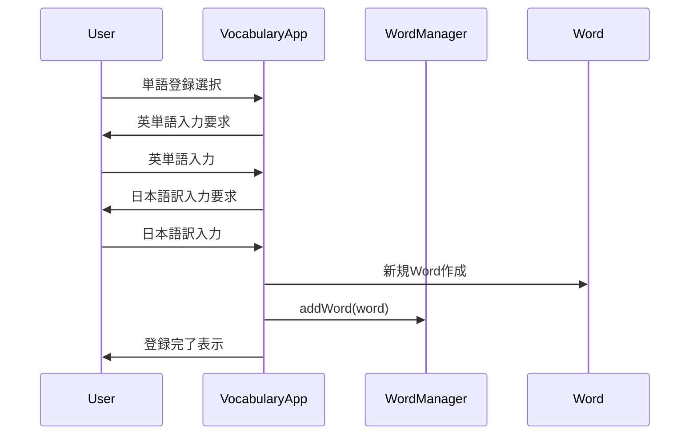
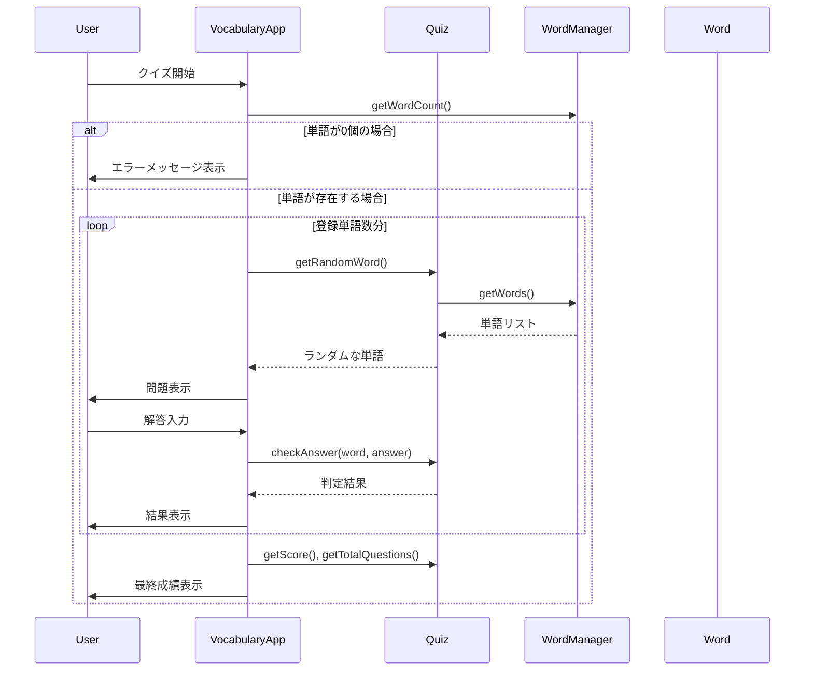
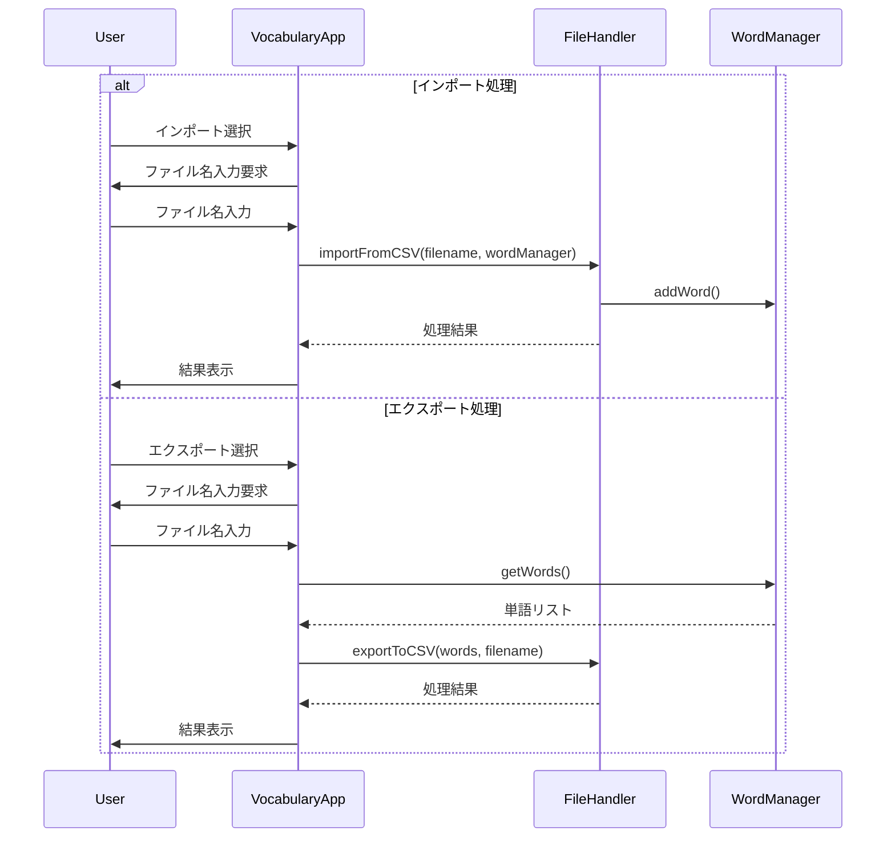

# 詳細設計書

## 1. クラス図

```mermaid
classDiagram
    VocabularyApp --> WordManager
    VocabularyApp --> Quiz
    VocabularyApp --> FileHandler
    WordManager --> Word
    Quiz --> WordManager
    
    class VocabularyApp {
        -WordManager wordManager
        -Quiz quiz
        -FileHandler fileHandler
        -Scanner scanner
        +VocabularyApp()
        +start()
        -registerWord()
        -startQuiz()
        -importWords()
        -exportWords()
        +main(String[] args)
    }
    
    class Word {
        -String english
        -String japanese
        +Word(String english, String japanese)
        +getEnglish()
        +getJapanese()
        +setEnglish(String english)
        +setJapanese(String japanese)
    }
    
    class WordManager {
        -List~Word~ words
        +WordManager()
        +addWord(Word word)
        +getWords()
        +getWordCount()
    }
    
    class Quiz {
        -WordManager wordManager
        -int score
        -int totalQuestions
        +Quiz(WordManager wordManager)
        +checkAnswer(Word word, String answer)
        +getRandomWord()
        +getScore()
        +getTotalQuestions()
    }
    
    class FileHandler {
        +exportToCSV(List~Word~ words, String filename)
        +importFromCSV(String filename, WordManager wordManager)
    }
```

## 2. シーケンス図

### 2.1 単語登録機能

```mermaid
sequenceDiagram
    participant User
    participant VocabularyApp
    participant WordManager
    participant Word
    
    User->>VocabularyApp: 単語登録選択
    VocabularyApp->>User: 英単語入力要求
    User->>VocabularyApp: 英単語入力
    VocabularyApp->>User: 日本語訳入力要求
    User->>VocabularyApp: 日本語訳入力
    VocabularyApp->>Word: 新規Word作成
    VocabularyApp->>WordManager: addWord(word)
    VocabularyApp->>User: 登録完了表示
```

### 2.2 クイズ機能

```mermaid
sequenceDiagram
    participant User
    participant VocabularyApp
    participant Quiz
    participant WordManager
    participant Word
    
    User->>VocabularyApp: クイズ開始
    VocabularyApp->>WordManager: getWordCount()
    alt 単語が0個の場合
        VocabularyApp->>User: エラーメッセージ表示
    else 単語が存在する場合
        loop 登録単語数分
            VocabularyApp->>Quiz: getRandomWord()
            Quiz->>WordManager: getWords()
            WordManager-->>Quiz: 単語リスト
            Quiz-->>VocabularyApp: ランダムな単語
            VocabularyApp->>User: 問題表示
            User->>VocabularyApp: 解答入力
            VocabularyApp->>Quiz: checkAnswer(word, answer)
            Quiz-->>VocabularyApp: 判定結果
            VocabularyApp->>User: 結果表示
        end
        VocabularyApp->>Quiz: getScore(), getTotalQuestions()
        VocabularyApp->>User: 最終成績表示
    end
```

### 2.3 ファイル操作機能

```mermaid
sequenceDiagram
    participant User
    participant VocabularyApp
    participant FileHandler
    participant WordManager
    
    alt インポート処理
        User->>VocabularyApp: インポート選択
        VocabularyApp->>User: ファイル名入力要求
        User->>VocabularyApp: ファイル名入力
        VocabularyApp->>FileHandler: importFromCSV(filename, wordManager)
        FileHandler->>WordManager: addWord()
        FileHandler-->>VocabularyApp: 処理結果
        VocabularyApp->>User: 結果表示
    else エクスポート処理
        User->>VocabularyApp: エクスポート選択
        VocabularyApp->>User: ファイル名入力要求
        User->>VocabularyApp: ファイル名入力
        VocabularyApp->>WordManager: getWords()
        WordManager-->>VocabularyApp: 単語リスト
        VocabularyApp->>FileHandler: exportToCSV(words, filename)
        FileHandler-->>VocabularyApp: 処理結果
        VocabularyApp->>User: 結果表示
    end
```
